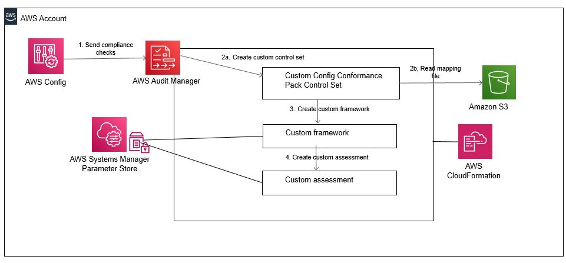

# Automate audit preparation in AWS and integrate across the Three Lines Model - Transform AWS Config Conformance Packs to AWS Audit Manager Assessments

Converts an AWS Config Conformance Pack into an AWS Audit Manager Assessment

The Audit Manager assessment is based on a custom AWS Audit Manager framework that is comprised of custom AWS Audit Manager control sets. The Audit Manager control set contains custom AWS Audit Manager controls related to AWS Config Conformance Pack based Config rules.

Pre-req- Takes a csv as input that comprises of all the Config rules within the AWS Config Conformance Pack

## Solution Design

## How To Install

**Prerequisites**

1. Ensure that AWS Config is enabled in your account.

2. Follow the steps to set up AWS Audit Manager.

3. Create an Amazon Simple Storage Service (Amazon S3) bucket with the following name: s3-customauditmanagerframework-AccountId-Region where AccountId is your AWS account ID and Region is the AWS Region where you plan to deploy the CloudFormation templates in the setup. In this bucket, create a folder named CustomAuditManagerFramework_Lambda. Upload the CustomAuditManagerFramework_Lambda.zip (in the lambda folder) file there.

4. Upload the mapping file to the top directory of the S3 bucket you created in Step 3. This mapping file is a csv that maps the control name of the compliance framework to the list of AWS Config Rules in the conformance pack. Sample mapping file for NIST-CSF is provided here--nistmappingcsv1.csv (in the mappingfile folder) 

5. Create an IAM user with Audit owner permissions. https://docs.aws.amazon.com/audit-manager/latest/userguide/security_iam_service-with-iam.html#security_iam_service-with-iam-id-based-policies. You can use the AWSAuditManagerAdministratorAccess policy as a starting point but please remember to scope down these permissions as needed to fit your requirements.

6. If you have already configured an assessment reports destination in your Audit Manager settings then you can skip this step. Otherwise for our solution you can simply reuse the S3 bucket from step 3 and create another folder for e.g. evidences. Your assessment reports destination will be the S3 URI for e.g. s3://s3-customauditmanagerframework-AccountId-Region/evidences/ in this case where AccountId is your AWS account ID and Region is the AWS Region where you plan to deploy the CloudFormation templates in the setup.

**Setup** 

The solution automates the initial setup and deployment in two steps:

1.	Launch the **aws-auditmanager-confpack.yml** template. For parameters - 1) Provide the name of the S3 bucket and folder (from step 3 in the prerequisites) that contains the source CustomAuditManagerFramework_Lambda.zip 2) Provide the name of the mapping file (from step 4) in the ConfPackControlsMappingFile parameter

2. Launch the **aws-auditmanager-customassessment.yml** template. Provide the s3 uri (from step 6 in the prerequisites) that is the assessment destination as a parameter and 2) Provide the ARN of the Audit owner IAM user from step 5 in the pre-requisites

**Cleanup**

1. Delete the CloudFormation stacks in sequence- 1) aws-auditmanager-customassessment.yml and then 2) aws-auditmanager-confpack.yml
2. Delete the custom framework  as well as the custom controls created in Audit Manager (you can do this from the console)
3. Delete the Audit Manager framework ID from the SSM parameter store

